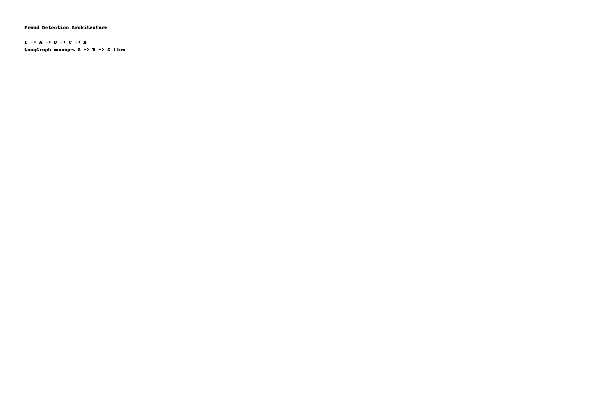

# AI-Powered Fraud Detection Workflow

This project implements a real-time fraud detection system using **multi-agent orchestration**. It combines rule-based checks, large language model explanations, and analytics logging to provide actionable insights on anomalous transactions.

---

## Features

- **Real-Time Transaction Monitoring**: Ingests transactions via **Kafka** or **AWS Kinesis** streams.  
- **Agent A - Rule-Based Checks**: Applies predefined rules to detect suspicious activity.  
- **Agent B - LLM Explanations**: Uses a Large Language Model (LLM) to explain anomalies in natural language.  
- **Agent C - Logging & Analytics**: Logs all transaction anomalies into **Amazon Redshift** for dashboards and reporting.  
- **Orchestration**: **LangGraph** manages the flow between agents to ensure smooth and scalable processing.  

---

## Architecture

```mermaid
flowchart LR
    T[Transaction Stream - Kafka/Kinesis] --> A[Agent A - Rule-Based Checks]
    A --> B[Agent B - LLM Explains Anomalies]
    B --> C[Agent C - Logs to Redshift]
    C --> D[Analytics Dashboards]
    subgraph Orchestration
        LangGraph manages A --> B --> C flow
    end
````



---

## Tech Stack

* **Languages & Frameworks**: Python
* **Messaging & Streaming**: Kafka / AWS Kinesis
* **LLM & NLP**: LangChain / Custom LLM Integration
* **Data Storage**: Amazon Redshift
* **Orchestration**: LangGraph
* **Visualization**: Analytics Dashboards (Redshift + BI Tool)

---

## Setup Guide

1. **Install Mermaid CLI** (for diagram generation):

   ```bash
   npm install -g @mermaid-js/mermaid-cli
   ```

2. **Save diagram to a `.mmd` file**:

   ```bash
   echo 'flowchart LR
       T[Transaction Stream - Kafka/Kinesis] --> A[Agent A - Rule-Based Checks]
       A --> B[Agent B - LLM Explains Anomalies]
       B --> C[Agent C - Logs to Redshift]
       C --> D[Analytics Dashboards]
       subgraph Orchestration
           LangGraph manages A --> B --> C flow
       end' > fraud_architecture.mmd
   ```

3. **Generate PNG diagram**:

   ```bash
   mmdc -i fraud_architecture.mmd -o fraud_architecture.png
   ```

4. **Install project dependencies**:

   ```bash
   pip install -r requirements.txt
   ```

5. **Run the application**:

   ```bash
   python main.py
   ```

---

## Usage

1. Ingest transaction data from your stream (Kafka/Kinesis).
2. Agent A will flag transactions based on rules.
3. Agent B generates human-readable explanations for anomalies.
4. Agent C logs everything into Redshift for analytics and dashboard visualizations.

---

## Impact

* **Scalable & Real-Time**: Detects fraud in near real-time.
* **Explainable AI**: LLM provides context for flagged transactions.
* **Integrated Analytics**: All anomalies are logged for monitoring, reporting, and dashboarding.

---

## License

This project is licensed under the MIT License.

---
